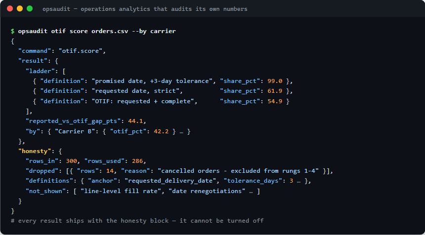

# opsaudit — operations analytics that audits its own numbers

[](https://github.com/gulmezeren2-byte/opsaudit/actions/workflows/ci.yml)  

🇹🇷 Türkçesi: [README.tr.md](README.tr.md)

> Every ops metric depends on definition choices that rarely survive the trip to a slide. `opsaudit` computes the classic analyses — OTIF, forecast accuracy, ABC-XYZ, Pareto — and refuses to hand back a number without its **honesty block**: what was dropped, which definitions were used, and what the result does *not* show.
>
> JSON-only output. Built for AI agents, pipelines and humans who read footnotes.

```bash
pip install git+https://github.com/gulmezeren2-byte/opsaudit
```



## The agent contract

1. **JSON-only stdout.** Results and data errors alike are JSON (`{"error": {...}}` + non-zero exit). Usage errors go to stderr with exit 2. Nothing else is ever printed.
2. **Self-documenting.** `--help` everywhere with examples; `opsaudit schema <command>` prints the expected input columns as JSON.
3. **Never interactive.** No prompts, no confirmations, no TTY assumptions.
4. **Stateless.** Same input, same output. Nothing is written anywhere.

## Commands

| Command | What it computes |
|---------|-----------------|
| `opsaudit otif score orders.csv [--by carrier] [--tolerance 3]` | The 5-rung OTIF metric ladder (tolerant → strict), promise-padding, tail stats, segment breakdown |
| `opsaudit forecast backtest demand.csv [--horizon 6]` | Rolling-origin backtest of five baselines; WMAPE, bias, MAPE-with-disclosure and FVA vs naive |
| `opsaudit abc segment demand.csv [--cv-x 0.5 --cv-z 1.0]` | ABC-XYZ classification with a 9-box summary and explicit, overridable thresholds |
| `opsaudit pareto rank events.csv --category reason [--weight minutes] [--exposure machine_hours]` | Decision-grade Pareto: label hygiene, unit discipline, exposure normalization |
| `opsaudit schema <command>` | The expected input schema, as JSON |

## What the output looks like

```
$ opsaudit otif score orders.csv --by carrier
{
  "tool": "opsaudit",
  "command": "otif.score",
  "result": {
    "orders_delivered": 286,
    "ladder": [
      {"rung": 1, "definition": "promised date, +3-day tolerance", "share_pct": 99.0},
      {"rung": 2, "definition": "promised date, strict",           "share_pct": 80.1, "delta_pts": -18.9},
      {"rung": 3, "definition": "requested date, strict",          "share_pct": 61.9, "delta_pts": -18.2},
      {"rung": 4, "definition": "OTIF: requested date + complete", "share_pct": 54.9, "delta_pts": -7.0},
      {"rung": 5, "definition": "OTIF incl. cancellations",        "share_pct": 52.3, "delta_pts": -2.6}
    ],
    "reported_vs_otif_gap_pts": 44.1,
    "by": {"Carrier A": {"otif_pct": 60.9}, "Carrier B": {"otif_pct": 42.2}, "Carrier C": {"otif_pct": 59.1}}
  },
  "honesty": {
    "rows_in": 300,
    "rows_used": 286,
    "dropped": [
      {"rows": 14, "reason": "cancelled orders - excluded from rungs 1-4, included in rung 5"}
    ],
    "definitions": {
      "anchor_rungs_1_2": "promised_delivery_date",
      "anchor_rungs_3_5": "requested_delivery_date",
      "tolerance_days_rung_1": 3,
      "in_full_level": "order (all lines complete)"
    },
    "not_shown": [
      "line-level fill rate (a complementary metric, not computed here)",
      "whether requested dates were renegotiated after order entry",
      "root causes beyond the optional --by segmentation"
    ]
  }
}
```

The `honesty` block is not optional and cannot be turned off. That is the point.

## Install

```bash
pip install git+https://github.com/gulmezeren2-byte/opsaudit
# or, for development:
git clone https://github.com/gulmezeren2-byte/opsaudit && cd opsaudit && pip install -e .
python -m pytest tests/   # 8 end-to-end tests
```

Requires Python 3.10+. Dependencies: pandas, numpy — nothing else.

## For AI agents

A typical agent workflow:

1. `opsaudit schema otif.score` → learn the expected columns
2. Map/rename the user's export to the schema
3. `opsaudit otif score data.csv --by carrier` → parse the JSON
4. Report the result **together with the honesty block** — the definitions and `not_shown` entries are what keep the agent's summary from over-claiming

Pairs with the [industrial-engineering-ai-skills](https://github.com/gulmezeren2-byte/industrial-engineering-ai-skills) method pack: the skills carry the judgment, `opsaudit` carries the computation.

## How it compares

| | Deterministic | Definitions disclosed | Machine-readable caveats | Agent-friendly output |
|---|:---:|:---:|:---:|:---:|
| Hand-rolled pandas script | ✓ | rarely | ✗ | ✗ |
| BI dashboard | ✓ | sometimes | ✗ | ✗ |
| Freeform LLM analysis | ✗ | ✗ | ✗ | ~ |
| **opsaudit** | ✓ | **always — enforced** | **✓ honesty block** | **✓ JSON contract** |

## Why an honesty block?

Because the number is never the whole finding. "99% on-time" and "55% OTIF" describe the same orders — the difference is four definition choices, and whoever controls the definitions controls the story. This tool's position: compute honestly, disclose loudly, and make the caveats machine-readable so even an AI summarizing the output has to see them. The methodology behind each command is demonstrated with charts and synthetic data in the *measurement honesty* series: [otif-analytics](https://github.com/gulmezeren2-byte/otif-analytics) · [forecast-accuracy-lab](https://github.com/gulmezeren2-byte/forecast-accuracy-lab) · [abc-xyz-inventory](https://github.com/gulmezeren2-byte/abc-xyz-inventory) · [auto-report-pipeline](https://github.com/gulmezeren2-byte/auto-report-pipeline)

## Roadmap

- [ ] PyPI release
- [ ] `opsaudit report weekly` — the full weekly-report contract as a command
- [ ] MCP server wrapper (same engines, tool-call interface)
- [ ] Croston/SBA baselines for intermittent demand
- [ ] Excel (`.xlsx`) input support

## About

Designed and built by **[Eren Gülmez](https://www.linkedin.com/in/erengulmez)** — industrial engineer, İstanbul. I design measurement systems and direct modern tooling to ship them; this CLI is the series' engine room, packaged for reuse.

## License

[MIT](LICENSE)
